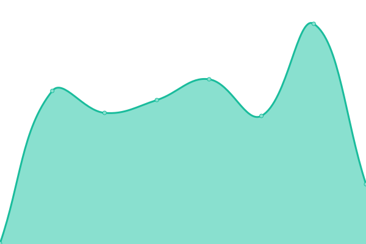

# [📈 Live Status](https://status.plak.io): <!--live status--> **🟩 All systems operational**

This repository contains the open-source uptime monitor and status page for [Plak](https://plak.io), powered by [Upptime](https://github.com/upptime/upptime).

With [Upptime](https://upptime.js.org), you can get your own unlimited and free uptime monitor and status page, powered entirely by a GitHub repository. We use [Issues](https://github.com/plakio/uptime/issues) as incident reports, [Actions](https://github.com/plakio/uptime/actions) as uptime monitors, and [Pages](https://status.plak.io) for the status page.

<!--start: status pages-->
<!-- This summary is generated by Upptime (https://github.com/upptime/upptime) -->
<!-- Do not edit this manually, your changes will be overwritten -->
<!-- prettier-ignore -->
| URL | Status | History | Response Time | Uptime |
| --- | ------ | ------- | ------------- | ------ |
|  [Sitio web](https://plak.io/) | 🟩 Up | [sitio-web.yml](https://github.com/plakio/status/commits/HEAD/history/sitio-web.yml) | 

 259ms
     
 | 

<a href="https://status.plak.io/history/sitio-web">100.00%</a>
    

|  [Panel de control](https://cloud.plak.io/login) | 🟩 Up | [panel-de-control.yml](https://github.com/plakio/status/commits/HEAD/history/panel-de-control.yml) | 

 411ms
     
 | 

<a href="https://status.plak.io/history/panel-de-control">100.00%</a>
    

|  [Portal de soporte](https://soporte.plak.io/) | 🟩 Up | [portal-de-soporte.yml](https://github.com/plakio/status/commits/HEAD/history/portal-de-soporte.yml) | 

 338ms
     
 | 

<a href="https://status.plak.io/history/portal-de-soporte">100.00%</a>
    

|  [Comunidad de usuarios](https://comunidad.plak.io/) | 🟩 Up | [comunidad-de-usuarios.yml](https://github.com/plakio/status/commits/HEAD/history/comunidad-de-usuarios.yml) | 

 204ms
     
 | 

<a href="https://status.plak.io/history/comunidad-de-usuarios">100.00%</a>
    

|  [NSLookup](https://lookup.plak.io/) | 🟩 Up | [ns-lookup.yml](https://github.com/plakio/status/commits/HEAD/history/ns-lookup.yml) | 

 187ms
     
 | 

<a href="https://status.plak.io/history/ns-lookup">100.00%</a>
    

|  [Sandbox](https://sandbox.plak.io/) | 🟩 Up | [sandbox.yml](https://github.com/plakio/status/commits/HEAD/history/sandbox.yml) | 

 383ms
     
 | 

<a href="https://status.plak.io/history/sandbox">100.00%</a>
    

|  [Plak CLI](https://plak.sh/) | 🟩 Up | [plak-cli.yml](https://github.com/plakio/status/commits/HEAD/history/plak-cli.yml) | 

 329ms
     
 | 

<a href="https://status.plak.io/history/plak-cli">100.00%</a>
    

|  [lemp.run](https://lemp.run/) | 🟩 Up | [lemp-run.yml](https://github.com/plakio/status/commits/HEAD/history/lemp-run.yml) | 

 363ms
     
 | 

<a href="https://status.plak.io/history/lemp-run">100.00%</a>
    

<!--end: status pages-->

[**Visit our status website →**](https://status.plak.io)

## 📄 License

- Powered by: [Upptime](https://github.com/upptime/upptime)
- Code: [MIT](./LICENSE) © [Anand Chowdhary](https://anandchowdhary.com), supported by [Pabio](https://pabio.com)
- Data in the `./history` directory: [Open Database License](https://opendatacommons.org/licenses/odbl/1-0/)
